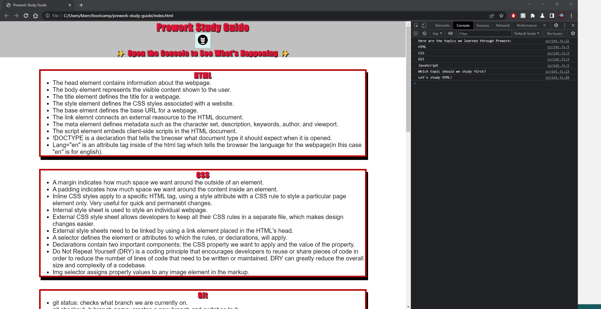

# Prework Study Guide Webpage

## Description

This is a prework study guide webpage that I have created as a starting ground for myself and other boot camp students who are going through the Prework.

## Table of Contents (Optional)

N/A

## Installation

N/A

## Usage

This prework study guide webpage is intended to help review notes from topics in the prework. For suggestions on what to review, you can access that information by opening the web console. Open the Chrome DevTools first by pressing Control+Shift+I (Windows) or Command+Option+I (macOS). Then there will be a tab for console and there you will be able to see a list of what all you can review and a suggestion of what to review first.

## Credits

N/A

## License

Please refer to the License in the repo. 

## Badges

Badges aren't necessary, but they demonstrate street cred. Badges let other developers know that you know what you're doing. Check out the badges hosted by [shields.io](https://shields.io/). You may not understand what they all represent now, but you will in time.

## Features

If your project has a lot of features, list them here.

## How to Contribute

If you created an application or package and would like other developers to contribute to it, you can include guidelines for how to do so. The [Contributor Covenant](https://www.contributor-covenant.org/) is an industry standard, but you can always write your own if you'd prefer.

## Tests

Go the extra mile and write tests for your application. Then provide examples on how to run them here.